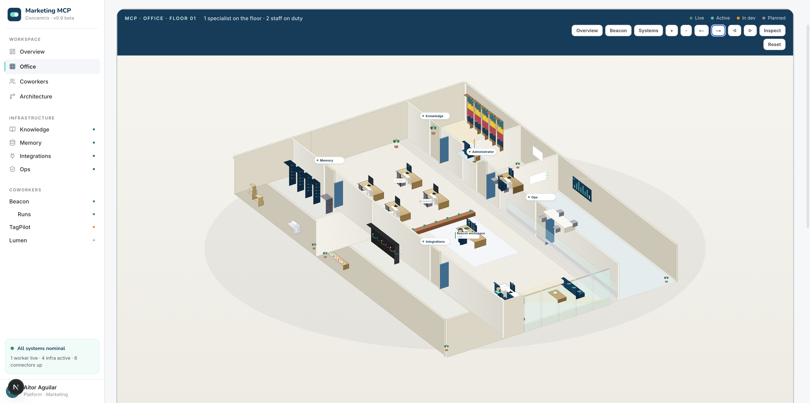

# marketing-mcp

marketing-mcp is the shared domain and capability layer for Concentrix marketing platform tooling. It provides reusable campaign domain models, execution truth, business context, and capability registries that application-layer tools — starting with Beacon — consume rather than reimplement.

It includes a visual operating environment — the **MCP Office** — that makes the entire system inspectable: workers, infrastructure, governance, and operational state, all driven by real data from the codebase.



---

## MCP Office

The MCP Office (`apps/mcp-office`) is a Next.js application that serves as the operating environment for the Marketing MCP. It is not a decorative dashboard — it is the place where you inspect and understand everything the MCP contains today.

### What it exposes

- **Workers** — Beacon (live, Google Ads specialist), TagPilot (in development), Lumen (planned)
- **Infrastructure** — Knowledge, Memory, Integrations, Ops — four shared systems that workers consume
- **Real system inventory** — campaign families, MCC accounts, brief rules, capabilities, sitelinks — all derived from actual package exports at build time
- **Infrastructure consumption** — which worker reads from which system, and what flows through each layer
- **Operational visibility** — gate status, allowlist state, readiness enforcement, approval controls
- **Data truth labels** — every section is tagged as "from codebase" (real) or "no source yet" (mock), so you always know what is inspectable vs illustrative

### Running locally

```bash
cd apps/mcp-office
npm install
npm run dev          # Webpack mode (stable, recommended)
npm run dev:turbo    # Turbopack mode (faster HMR, fragile cache)
```

Open `http://localhost:3000/mcp` to enter the MCP.

### Routes

| Route | Content |
|-------|---------|
| `/mcp` | Office scene, operational dashboard, infrastructure cards |
| `/mcp/beacon` | Beacon worker detail — families, rules, consumption, activity |
| `/mcp/knowledge` | Knowledge layer — 5 real data assets with counts |
| `/mcp/memory` | Memory layer — planned, no runtime data yet |
| `/mcp/integrations` | Integrations — 24 MCC accounts, 2 push-allowed |
| `/mcp/ops` | Ops — gate status, rules, allowlist, readiness |
| `/mcp/tagpilot` | TagPilot — future worker, in development |
| `/mcp/lumen` | Lumen — future worker, planned |

---

## Domain Layer

### What it is

marketing-mcp is a TypeScript monorepo structured as three packages:

- **`@mktg/core`** — shared primitives and Concentrix business context
- **`@mktg/domain-google-ads`** — Google Ads campaign domain models, readiness logic, and execution truth
- **`@mktg/adapter-beacon`** — Beacon-specific adapter consuming the two packages above

The packages are consumed by Beacon via local `file:` references. They are not published to a registry.

### Why it exists

Marketing platform tools tend to accumulate app-specific logic that should belong to a shared, stable domain layer. Brief validation rules, campaign family models, audience segment definitions, readiness guardrails, sitelink catalogs, and service normalization are not Beacon-specific — they are domain truth that any marketing tool in this ecosystem should be able to rely on.

marketing-mcp exists to be that shared home. Beacon is the first and currently only consumer.

### How it relates to Beacon

The division of responsibility is explicit:

| Layer | Owned by |
|---|---|
| Campaign brief intake, review, approval, push orchestration | Beacon |
| Google Ads API integration and payload construction | Beacon |
| UI, session management, run persistence | Beacon |
| Campaign domain types and family models | marketing-mcp |
| Readiness evaluation logic and guardrails | marketing-mcp |
| Audience segment definitions and mapping | marketing-mcp |
| Sitelink catalog, asset limits, UTM templates | marketing-mcp |
| Brief validation rules and clarification templates | marketing-mcp (`@mktg/adapter-beacon`) |
| Push allowlist and push control logic | marketing-mcp (`@mktg/adapter-beacon`) |
| Conversion event profiles | marketing-mcp (`@mktg/adapter-beacon`) |
| Concentrix service normalization | marketing-mcp |
| People targeting catalog | marketing-mcp |
| Supported capabilities registry | marketing-mcp |
| Vendor documentation connectors | marketing-mcp |

Beacon imports from marketing-mcp. marketing-mcp has no dependency on Beacon.

---

## Current Scope

### Concentrix business context (`@mktg/core`)

- **Audience segment library** — tiered corporate buyer roles (Tier 1 generalist, Tier 2 specialist, Tier 3 healthcare-gated) and careers segments; ad group context definitions for corporate and careers campaigns
- **Service normalization** — alias resolver mapping 46 canonical Concentrix service offerings (across Strategy & Design, Enterprise Technology, Data & Analytics, Digital Operations) to structured taxonomy codes; handles colloquial aliases, abbreviations, and substring matching
- **People targeting catalog** — 1,599 persona records across 8 industries and 5 service categories, sourced from Concentrix sector persona data; includes people roles, buying considerations, subsectors, and service relationship context
- **MCC operational context** — extracted truth from Concentrix Google Ads MCC: 24 active accounts, 40 campaigns, known legacy domain patterns (Convergys, ServiceSource, Webhelp), active relocation recruitment patterns (Portugal, Greece, Bulgaria), client-brand campaign context
- **Service suggestions** — scored ranking of audience segments and ad group contexts given a brief's service, objective, and audience signals; includes healthcare and procurement gates
- **Vendor documentation connector** — integration with Google Developer Docs API for retrieving documentation snippets; supports product-scoped lookup (google-ads, ga4, gtm, search-console)
- **Supported capabilities registry** — typed catalog of what Google Ads capabilities marketing-mcp currently supports, with support levels (`supported`, `partial`, `visible_only`, `unsupported`) per capability area

### Google Ads domain (`@mktg/domain-google-ads`)

- **Campaign family definitions** — structured definitions for all modeled Google Ads campaign types (Search, Display, Responsive Display, Video, Demand Gen, Shopping, Performance Max, App); each definition covers supported objectives, audience/feed/location dependence, asset complexity, and safe-with-partial-info indicators
- **Domain types** — `CampaignType`, `CampaignObjective`, `BiddingStrategy`, `ConversionStage`, `AudienceMode`, `CampaignContext` (corporate / careers), and related domain enumerations
- **Text asset requirements** — per-family minimum and maximum asset counts for Performance Max and Demand Gen; character limit constants for all asset types (headlines, descriptions, long headlines, sitelink text, callouts, business name)
- **Readiness evaluation** — guardrail logic for evaluating campaign family readiness given brief inputs
- **Audience mapping** — audience segment execution guidance and segment mapping definitions keyed by campaign context
- **Sitelink catalog** — 100+ pre-approved Concentrix sitelinks with text, descriptions, and canonical URLs, organized by service family; used for sitelink selection in brief processing
- **Concentrix Google Ads context** — UTM tracking templates per family (Search, Display, Performance Max, Demand Gen), bid strategy defaults (primary: `maximize_conversions`, fallback: `maximize_clicks`), quality benchmarks, and MCC-sourced account context

### Beacon adapter (`@mktg/adapter-beacon`)

- **Brief validation rules** — catalog of hard, soft, and informational brief rules (`BRIEF-001` through `BRIEF-008` and beyond); each rule has a target field, severity, category, and associated clarification question template
- **Push allowlist** — server-side allowlist controlling which Concentrix Google Ads accounts Beacon is permitted to push to; currently Phase 1 pilot (2 accounts: Concentrix Portugal, Google_Ads_CNX DACH); accounts not on this list cannot receive pushes regardless of blueprint state
- **Conversion focus event profiles** — typed catalog of Concentrix conversion events for careers and corporate contexts; each profile includes conversion label, funnel stage, intent, and Google Ads mapping hint; used for conversion action selection and measurement evaluation
- **Sitelink prompt builder** — renders the sitelink catalog as a structured LLM prompt block with selection rules (exact URL match → normalized path → parent path → service family → generic fallback); context-aware (corporate includes "Contact Us", careers never does)

---

## Architecture Role

### What belongs in marketing-mcp

- **Domain truth that is stable across consumers** — campaign type definitions, asset limits, readiness guardrails, audience segments
- **Concentrix business context** — anything derived from Concentrix's own data (MCC state, service taxonomy, people targeting, approved vocabulary) that multiple tools would need
- **Capability registries** — what Google Ads features are supported, at what level, and with what constraints
- **Shared rules and catalogs** — brief validation rules, sitelink catalog, conversion event profiles; these are not app logic, they are governed tables

### What belongs in Beacon

- **Application orchestration** — the processing pipeline, blueprint generation, review flow, push execution
- **Google Ads API integration** — payload construction, validate and push API calls, account resolution, runtime readiness recompute
- **UI and session** — the brief intake form, review screen, ads preview, authentication, run persistence
- **Family-specific execution logic** — model builders, creative asset execution truth evaluation, launch readiness computation; these depend on runtime brief state and live account context

### Why the split exists

Application-layer logic tends to accumulate assumptions about a single consumer (Beacon's brief shape, Beacon's pipeline state) that make it hard to reuse. marketing-mcp is where logic that should not accumulate those assumptions lives. The test is: if a second marketing tool were built tomorrow, would it need this? If yes, it belongs here.

---

## Packages

### `@mktg/core`

```
src/
├── types.ts                      # Shared primitive types (Option, etc.)
├── index.ts                      # Module exports
├── concentrix/
│   ├── segment-library.ts        # Audience segments and ad group context definitions
│   ├── service-suggestions.ts    # Scored segment/context ranking given brief signals
│   ├── mcc-knowledge.ts          # MCC-extracted operational truth (accounts, domains, patterns)
│   ├── people-targeting.ts       # Industry/role/buying consideration mappings
│   └── service-normalization.ts  # Alias → canonical service resolver
└── knowledge/
    ├── vendor-docs/
    │   ├── types.ts              # VendorDocSnippet, VendorDocSearchResult
    │   └── google/developer-docs.ts  # Google Developer Docs API connector
    └── supported-capabilities/
        ├── types.ts              # Capability registry types
        └── google-ads.ts        # MCP-owned Google Ads capability truth
```

**Data assets** (consumed by `@mktg/core`):
- `data/services/alias_mapping.json` — 44 canonical service offerings with aliases and taxonomy codes
- `data/services/service_taxonomy.json` — 73 Concentrix service offerings (4 categories, 20 groups) with descriptions, sub-offerings, and industry associations
- `data/people-targeting/catalog.json` — 1,599 persona records across 8 industries
- `data/people-targeting/coverage.md` — readable coverage index by industry and service category
- `data/people-targeting/structure.md` — schema and normalization rules for the catalog
- `data/mcc-export/insights-2026-04-02.md` — structured MCC account snapshot (24 accounts, 40 active campaigns, budget and naming analysis)

### `@mktg/domain-google-ads`

```
domain-google-ads/src/
├── types.ts                  # CampaignType, CampaignObjective, BiddingStrategy, etc.
├── model.ts                  # Campaign family definitions and text asset requirements
├── readiness.ts              # Readiness evaluation and guardrail logic
├── audience-mapping.ts       # Audience execution guidance and segment mapping
├── sitelink-catalog.ts       # 100+ pre-approved Concentrix sitelinks
├── asset-limits.ts           # Character limits for all asset types
├── concentrix-context.ts     # UTM templates, bid defaults, MCC context, benchmarks
└── index.ts                  # Module exports
```

**Dependencies**: `@mktg/core`

### `@mktg/adapter-beacon`

```
adapters/beacon/src/
├── brief-rules/
│   ├── catalog.ts            # Hard/soft/informational brief validation rules
│   └── clarifications.ts     # Clarification question templates keyed to rules
├── push-control/
│   └── allowlist.ts          # Server-side push allowlist (phased rollout by account)
├── conversion/
│   └── focus-events.ts       # Careers and corporate conversion event profiles
├── prompt-builders/
│   └── sitelinks.ts          # Sitelink catalog prompt renderer for LLM consumption
└── index.ts                  # Module exports
```

**Dependencies**: `@mktg/core`, `@mktg/domain-google-ads`

---

## Design Principles

**Shared truth over duplicated app logic**  
Domain models, validation rules, and capability registries should exist once and be consumed, not copied into each application that needs them.

**Family-correct domain modeling**  
Each Google Ads campaign family is a distinct requirement bundle with distinct objectives, audience modes, asset complexity, and readiness conditions. The domain layer models these differences explicitly rather than abstracting them into a lowest-common-denominator structure.

**Canonical capability truth**  
The supported capabilities registry documents what is actually supported, at what level, with what known constraints. This is typed and structured — not prose comments or guesses.

**Concentrix-specific where warranted**  
The context layer is Concentrix-specific by design: MCC account state, service taxonomy, approved vocabulary, and people targeting data are Concentrix operational truth, not generic platform abstractions. Reusability within Concentrix tooling is the goal — not reusability across unrelated organizations.

**Execution-truth-first expansion**  
New domain additions should reflect what is actually executable. Adding a capability to the supported capabilities registry, or a new campaign family definition, should reflect real execution capability — not aspirational coverage.

---

## Current Status

marketing-mcp is the active domain backbone for Beacon. Its core modules — service normalization, people targeting, sitelink catalog, campaign family definitions, brief rules, push allowlist, and conversion profiles — are actively consumed by Beacon in the current internal product.

What is stable:
- Service alias mapping and normalization (44 offerings, fully implemented)
- People targeting catalog (1,599 records, 8 industries)
- Campaign family type definitions and domain types
- Audience segment library and service suggestion scoring
- Sitelink catalog and sitelink prompt builder
- Brief validation rules and clarification templates
- Push allowlist (Phase 1 pilot: 2 accounts)
- Conversion focus event profiles (careers and corporate)
- Asset limits and UTM templates
- Vendor documentation connector (functional with API key)
- Supported capabilities registry (15 capability areas)

What is still evolving:
- Family-specific campaign modeling is split across `@mktg/domain-google-ads` and Beacon's own model builders; further consolidation into the domain layer is ongoing, particularly for Demand Gen and Performance Max
- The readiness evaluation logic (`readiness.ts`) is functional but will continue to align with Beacon's three-layer execution truth model as that model matures
- No build tooling is configured at the monorepo level; packages are consumed by Beacon via direct TypeScript import through the `file:` dependency mechanism
- No automated tests are present; correctness is currently validated through Beacon's runtime consistency harness

---

## Vision

**marketing-mcp as the reusable backbone**  
The package structure exists so that domain truth does not get trapped in Beacon. Service normalization, people targeting, campaign family definitions, and capability registries are platform-level concerns. As additional marketing tools are built within Concentrix's ecosystem, they should consume this layer rather than rebuild it.

**Beacon as the first consumer, not the only one**  
Beacon's needs currently shape what gets built here, but the modules are intentionally decoupled from Beacon's runtime and brief shape. `@mktg/core` in particular is designed for broad reuse — it has no dependency on Google Ads specifics.

**Expansion grounded in real execution truth**  
New domain models, capability registrations, or platform packages should be added when they represent things that are actually executable or actually true — not because a future roadmap suggests they might be useful. The supported capabilities registry exists partly to enforce this discipline: it makes the gap between what is real and what is aspirational explicit.

**Multi-platform potential**  
The architecture documentation describes planned connectors for Meta, LinkedIn, GA4, and GTM. These are not implemented. When they are, they belong in packages parallel to `@mktg/domain-google-ads` — domain-level truth for those platforms, with adapters per consumer application.

---

## Development

### Setup

This repo is consumed by Beacon as a sibling directory. In the standard Beacon local development setup, no separate packaging or publishing step is needed — Beacon references the packages directly via `file:` paths.

If working on marketing-mcp independently:

```bash
npm install
```

Workspaces are declared at the root. npm will link `@mktg/domain-google-ads` and `@mktg/adapter-beacon` as local packages.

### Dependency on `GOOGLE_DEVELOPER_KNOWLEDGE_API_KEY`

The vendor docs connector (`src/knowledge/vendor-docs/google/developer-docs.ts`) requires a `GOOGLE_DEVELOPER_KNOWLEDGE_API_KEY` environment variable. This is only needed if the connector is actively used. Beacon's pipeline does not require it for standard operation.

### Consuming from Beacon

Beacon's `package.json` references these packages via:

```json
"@mktg/core": "file:../marketing-mcp",
"@mktg/adapter-beacon": "file:../marketing-mcp/adapters/beacon",
"@mktg/domain-google-ads": "file:../marketing-mcp/domain-google-ads"
```

In Beacon's current local development flow, no separate build step is needed — Next.js transpiles the TypeScript source from these packages directly. If packages are consumed outside that context, a build step would be required.

### Architecture documentation

`docs/architecture/composable-marketing-architecture.md` contains the detailed system design, integration diagrams, and the Beacon/MCP split rationale.
