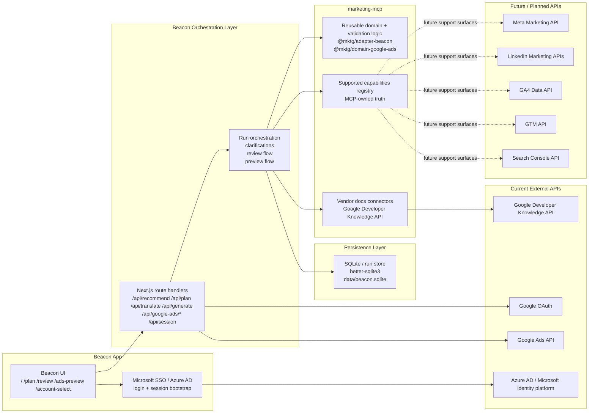

# Composable Marketing Architecture

> **Concept-level architecture doc.** The split narrative and the Beacon↔MCP boundary are current. The specific API route names inside the Mermaid diagrams below are illustrative — Beacon's active intake flow today is `POST /api/recommend` → `POST /api/plan` (SSE) → `POST /api/translate`, with `POST /api/generate` for clarification regeneration, plus `app/api/google-ads/*`. For live route-level truth, see Beacon's `consultation-map.md`.

## Purpose

This document explains the shared composable architecture that sits above any one app consumer.

It is the canonical architecture document for:

- `marketing-mcp`
- vendor documentation connectors
- MCP-supported capability registries
- reusable domain, execution, and validation logic
- current and future platform integrations
- the current Beacon-to-MCP split

This document does not belong to Beacon alone. Beacon is one app consumer and orchestrator inside this architecture.

## Architecture Overview

Beacon is not just a Next.js UI. It is a small orchestration system consuming an explicit shared capability layer with named internal and external integrations.

The current architecture is:

1. app consumer layer such as Beacon
2. app orchestration layer in product-specific routes and server logic
3. shared decision and domain logic from `marketing-mcp`
4. MCP-owned support truth and reusable validation / execution logic
5. persistence in the app runtime
6. explicit external platform integrations

The central architectural rule is:

- vendor docs describe what the platform says is possible
- supported capabilities describe what `marketing-mcp` actually supports today

For product behavior, supported capabilities always win.

## Named Integration Surfaces

### Current integrations

- Microsoft SSO / Azure AD via `@azure/msal-node`
- Google OAuth for user-connected Google Ads access
- Google Ads API for account discovery, validation, and paused-push flows across Beacon's current six-family runtime scope: Search, Search (local), Display, Responsive Display, Demand Gen, and Performance Max
- Google Developer Knowledge API for official Google documentation grounding
- SQLite (`data/beacon.sqlite`) for runs, auth state, and Google connection persistence

### Planned integrations

- Meta Marketing API
- LinkedIn Marketing APIs
- GA4 Data API
- GTM API
- Search Console API

These planned integrations are future platform targets, not current execution truth.

## Beacon vs marketing-mcp Split

### Beacon owns

- app UI and route handlers
- runtime orchestration
- current multi-family Google Ads runtime covering Search, Search (local), Display, Responsive Display, Demand Gen, and Performance Max
- session handling
- Google OAuth callback flow
- Google Ads account selection and push orchestration
- SQLite persistence for runs, auth state, and connected accounts

### marketing-mcp owns

- reusable vendor documentation connectors
- supported capability registries
- shared domain models
- reusable validation logic
- reusable execution / readiness logic
- cross-platform expansion structure beyond Beacon

## Executive Architecture Diagram

## Technical Integration Diagram

```mermaid
flowchart TB
  subgraph Beacon["Beacon Next.js App"]
    Pages["Pages and shells\n/ /plan /review /ads-preview /account-select"]
    Middleware["Auth middleware / session gating"]
    Recommend["/api/recommend"]
    Plan["/api/plan (SSE)"]
    Translate["/api/translate"]
    Generate["/api/generate"]
    Session["/api/session"]
    GoogleRoutes["/api/google-ads/oauth/*\n/api/google-ads/accounts*\n/api/google-ads/validate\n/api/google-ads/push"]
    Login["/login + /api/auth/*"]
  end

  subgraph Orchestration["Current Orchestration Reality"]
    Resolver["Session + account resolution"]
    Planning["Plan orchestration\nlanding-page analysis\nclarification-ready outputs"]
    Execution["Validation / push orchestration\nGoogle Ads account selection\npreview preparation"]
  end

  subgraph MCPNow["marketing-mcp current reusable layer"]
    Adapter["@mktg/adapter-beacon\nbrief rules\nclarifications\nprompt builders"]
    Domain["@mktg/domain-google-ads\nreadiness\nasset limits\naudience mapping\nmodel types"]
    SupportRegistry["supported-capabilities/google-ads.ts\nwhat MCP supports today"]
    VendorDocs["vendor-docs/google/developer-docs.ts\nofficial Google docs search"]
  end

  subgraph Data["Persistence"]
    RunStore["SQLite run store\nruns\nversions\nreview state"]
    AuthStore["SQLite auth store\nBeacon users\nGoogle connections\nselected accounts"]
  end

  subgraph CurrentExternal["Current named external systems"]
    Azure["Azure AD / Microsoft SSO"]
    GoogleOAuth["Google OAuth consent"]
    GoogleAdsAPI["Google Ads API"]
    GoogleDevDocs["Google Developer Knowledge API"]
  end

  subgraph FutureComposable["Future composable direction"]
    MetaAPI["Meta Marketing API"]
    LinkedInAPI["LinkedIn Marketing APIs"]
    GA4API["GA4 Data API"]
    GTMAPI["GTM API"]
    SearchConsoleAPI["Search Console API"]
  end

  Pages --> Middleware
  Pages --> Recommend
  Pages --> Plan
  Pages --> Translate
  Pages --> Generate
  Pages --> Session
  Pages --> GoogleRoutes
  Pages --> Login

  Middleware --> Resolver
  Login --> Resolver
  Login --> Azure

  Recommend --> Planning
  Plan --> Planning
  Translate --> Planning
  Generate --> Planning
  Session --> Resolver
  GoogleRoutes --> Execution

  Resolver --> AuthStore
  Planning --> RunStore
  Execution --> RunStore
  Execution --> AuthStore

  Planning --> Adapter
  Planning --> Domain
  Planning --> SupportRegistry
  Planning --> VendorDocs

  Execution --> Domain
  Execution --> SupportRegistry

  VendorDocs --> GoogleDevDocs
  Execution --> GoogleOAuth
  Execution --> GoogleAdsAPI

  SupportRegistry -. planned future registries .-> MetaAPI
  SupportRegistry -. planned future registries .-> LinkedInAPI
  SupportRegistry -. planned future registries .-> GA4API
  SupportRegistry -. planned future registries .-> GTMAPI
  SupportRegistry -. planned future registries .-> SearchConsoleAPI
  VendorDocs -. planned future vendor-doc connectors .-> MetaAPI
  VendorDocs -. planned future vendor-doc connectors .-> LinkedInAPI
  VendorDocs -. planned future vendor-doc connectors .-> GA4API
  VendorDocs -. planned future vendor-doc connectors .-> GTMAPI
  VendorDocs -. planned future vendor-doc connectors .-> SearchConsoleAPI
```

## Current Orchestration Reality vs Future Composable Direction

### Current orchestration reality

Today Beacon itself is the runtime orchestrator:

- Next.js routes own session handling, run orchestration, and Google Ads integration calls
- Beacon persists run state, auth state, and Google connection state in SQLite
- `marketing-mcp` provides reusable logic, support truth, and vendor-doc lookup, but Beacon still composes the runtime flow
- Google Ads is the only real downstream execution surface today

### Future composable direction

The future architecture should keep app consumers such as Beacon separate from the shared capability layer:

- vendor docs connectors provide official platform reference retrieval
- supported capability registries define MCP-owned execution truth
- reusable validation / execution logic becomes less app-specific and more package-owned
- future platform integrations can be added without changing the core rule:
  vendor docs describe what platforms say is possible, but supported capabilities define what the MCP stack actually supports
